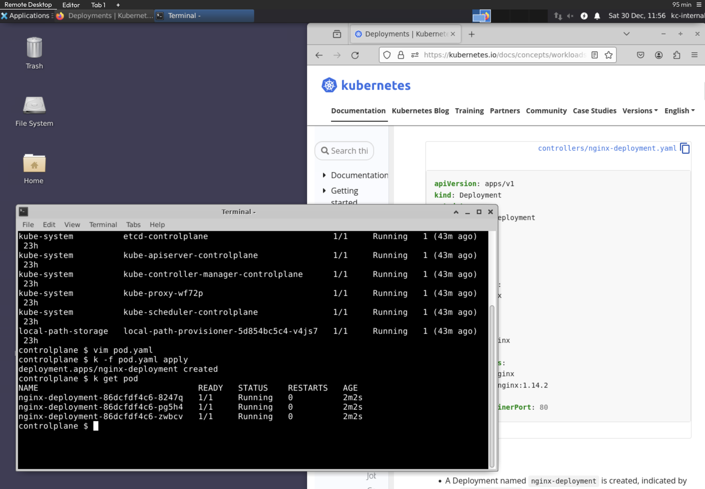

# Context

The following contains information about the exam.

## Exam Environment

Below is a screenshot of the exam environment. This [article](https://itnext.io/cks-cka-ckad-changed-terminal-to-remote-desktop-157a26c1d5e) goes into some detail about the exam environment.

* The CKAD exams use a Remote Desktop based on XFCE
* You'll need to use the remote Firefox browser to access the K8s docs

## General Information

Reference [see](https://training.linuxfoundation.org/blog/update-on-certification-exam-proctoring-migration/?utm_source=lftraining&utm_medium=twitter&utm_campaign=blog) and [this](https://docs.linuxfoundation.org/tc-docs/certification/faq-cka-ckad-cks)

### CLI Tools

For your convenience, all environments, in other words, the base system and the cluster nodes, have the following additional command-line tools pre-installed and pre-configured:

* `kubectl` with `k` alias and Bash autocompletion
* `jq` for YAML/JSON processing
* `tmux` for terminal multiplexing
* `curl` and `wget` for testing web services
* `man` and man pages for further documentation

### Exam issues with current resolutions

#### lag

* Some lag is expected in a remote-desktop/VNC connection environment, such as when moving windows or scrolling through pages like CNCF documentation.

#### Copy/Paste and Keyboard Shortcuts

The Linux Remote Desktop is a traditional Linux Environment and candidates need to use Linux Keyboard Shortcuts. The Terminal is a Linux Terminal, and candidates need to use Linux Terminal keyboard shortcuts:
* Copy = CTRL+SHIFT+C
* Paste = CTRL+SHIFT+V for Paste
* OR Use the Right Click Context Menu and select Copy or Paste

#### Personal Bookmarks/ Chrome Browser Not Available

* The Linux Remote Desktop includes a Firefox Browser; candidates are prohibited from accessing all sites except those listed in our Resources Allowed Policy.
* Personal browser bookmarks (such as bookmarked links to YAML files) are not accessible within the PSI Secure Browser.
* All Exam items have been updated with “Documentation Quick Links”, which provide links to the official Kubernetes documentation related to a handful of Kubernetes topics that might be required to solve a task.
* The Kubernetes documentation pages have been carefully selected to fit the topics and typically provide one or more YAML files that might help kickstart working on a task.

### What you will need

* A computer see [system requirement](https://helpdesk.psionline.com/hc/en-gb/articles/4409608794260--PSI-Bridge-FAQ-System-Requirements)
* Reliable internet access
* Microphone - Mac users may need to allow the PSI Secure Browser within their 'System Preferences: Security & Privacy: Privacy' settings for Microphone, Camera, Automation and Input Monitoring.
<!-- DEVTODO  figure out how to check this ahead of time -->
* Webcam - Mac users may need to allow the PSI Secure Browser within their 'System Preferences: Security & Privacy: Privacy' settings for Microphone, Camera, Automation and Input Monitoring.

### Expectations for an acceptable testing environment

#### Clutter-free work area

* No objects such as paper, writing implements, electronic devices, or other objects on top of surface
* No objects such as paper, trash bins, or other objects below the testing surface

#### Clear walls

* No paper/print outs hanging on walls
* Paintings and other wall décor is acceptable
* Candidates will be asked to remove non-décor items prior to the exam being released

#### Lighting

* Space must be well lit so that proctor is able to see candidate’s face, hands, and surrounding work area
* No bright lights or windows behind the examinee

#### Other

* Candidate must remain within the camera frame during the examination
* Space must be private where there is no excessive noise. Public spaces such as coffee shops, stores, open office environments, etc. are not allowed.

### FAQs

#### How long will the exam take?

Candidates are allowed 2 hours to complete exams.

#### What score is needed to pass the exam?

A score of 66% or above must be earned to pass.

#### What resources am I allowed to access during my exam?

During the exam, candidates may use the browser within the VM to access the following documentation:

* [https://kubernetes.io/docs](https://kubernetes.io/docs)
* [https://kubernetes.io/blog](https://kubernetes.io/blog)
* [https://helm.sh/docs ](https://helm.sh/docs)

#### Where can I find practice questions for CKAD

Candidates who register for the exam will have access to an exam simulator, provided by [Killer.sh](https://killer.sh/).  

Login to [My Portal](https://trainingportal.linuxfoundation.org/) and click Start/Resume to view your exam preparation checklist. The link to the Simulator is available on the Top Right-Hand corner of the Exam Preparation Checklist.

#### Is there training to prepare for the certification exam?

The Linux Foundation offers a free [Introduction to Kubernetes course](https://training.linuxfoundation.org/linux-courses/system-administration-training/introduction-to-kubernetes) which provides an introduction to many key concepts for Kubernetes. The [Fundamentals of Kubernetes (LFS258) course](https://training.linuxfoundation.org/linux-courses/system-administration-training/kubernetes-fundamentals) builds on this introductory material and is designed as preparation for the Certified Kubernetes Administrator Exam. 

The topics covered in the [Kubernetes for Developers (LFS259) course](https://training.linuxfoundation.org/training/kubernetes-for-developers/) are directly aligned with the knowledge domains tested by the Certified Kubernetes Application Developer Exam.
